# 📚 Bağdaş Kitap Dünyası

> Next.js, ASP.NET Core ve PostgreSQL ile geliştirilmiş tam kapsamlı bir online kitap satış platformu.
>
> 🔗 **[Canlı Demo](https://bagdaskitapdunyasi.vercel.app/)**


---

## Genel Bakış

Bağdaş Kitap Dünyası; kullanıcıların kitap arayıp satın alabileceği, yorum yapabileceği müşteri arayüzü ile birlikte ayrı bir yönetim paneline sahip tam işlevli bir online kitapçıdır. Kullanıcılar kategorilere göre kitap gezebilir, filtreleyip sıralayabilir, sepete ekleyip çok adımlı ödeme akışıyla sipariş verebilir. Yöneticiler ise ayrı bir panel üzerinden katalog, siparişler, kullanıcılar ve mağaza ayarlarını yönetir.

---

## Mimari

```
┌──────────────────────┐        REST API (JSON)       ┌─────────────────────────┐
│   Next.js 14         │ ────────────────────────────► │   ASP.NET Core 8 (C#)   │
│   TypeScript         │ ◄──────────────────────────── │   RESTful Controller'lar │
│   App Router (SSR)   │        JWT Bearer Token        │   Servis Katmanı / DTO  │
└──────────────────────┘                               └────────────┬────────────┘
                                                                    │
                                                       ┌────────────▼────────────┐
                                                       │      PostgreSQL 16       │
                                                       │   Entity Framework Core  │
                                                       └─────────────────────────┘
```

---

## Özellikler

### Müşteri Tarafı

- 🏠 Hero banner ve öne çıkan kitaplarla ana sayfa
- 📂 Dinamik routing ile kategori bazlı kitap listeleme (`/kategori/[slug]`)
- 🔍 Başlık veya yazar adıyla arama
- 🔽 Yayınevi ve fiyat aralığına göre filtreleme; önerilen / fiyat / puan sıralaması
- 📖 Stok durumu, kitap bilgileri ve kullanıcı yorumlarını içeren kitap detay sayfası
- ⭐ Yıldız bazlı puanlama ve yorum sistemi
- ❤️ Favorilere ekleme
- 🛒 Miktar kontrolü ve ücretsiz kargo ilerleme çubuğu olan sepet
- 💳 Çok adımlı ödeme akışı: teslimat adresi → ödeme bilgileri → sipariş onayı
- 👤 Kullanıcı profili: hesap bilgilerini düzenleme, geçmiş siparişleri görüntüleme, adres yönetimi
- 🔐 JWT tabanlı kayıt ve giriş sistemi

### Admin Paneli (`/admin`)

- 📊 Toplam kitap, kategori, kullanıcı ve sipariş özeti içeren genel bakış ekranı
- 📚 Kitap yönetimi: ekleme, düzenleme, silme, çok satan işaretleme, stok yönetimi
- 📦 Sipariş yönetimi: durum takibi (beklemede → hazırlanıyor → kargoda → teslim edildi)
- 👥 Kullanıcı yönetimi: tüm üyeleri görüntüleme, admin yetkisi verme veya alma
- 💬 Yorum moderasyonu: kullanıcı yorumlarını görüntüleme ve silme
- ⚙️ Mağaza ayarları: mağaza adı, kargo ücreti, ücretsiz kargo limiti, ödeme yöntemleri

---

## Teknoloji Yığını

| Katman           | Teknoloji                            |
| ---------------- | ------------------------------------ |
| Frontend         | Next.js 14, TypeScript, Tailwind CSS |
| Backend          | ASP.NET Core 8 (C#)                  |
| Veritabanı       | PostgreSQL 16                        |
| ORM              | Entity Framework Core                |
| Kimlik Doğrulama | JWT Bearer Token                     |
| Mimari           | RESTful API, MVC, DTO deseni         |

---

## Kurulum

### Gereksinimler

- Node.js 18+
- .NET 8 SDK
- PostgreSQL 16

### Backend Kurulumu

```bash
cd backend/BagdasKitapDunyasi/BagdasKitapDunyasi.API
```

`appsettings.Development.json` dosyasını oluştur (`.gitignore` ile versiyon kontrolü dışında tutulur):

```json
{
  "ConnectionStrings": {
    "DefaultConnection": "Host=localhost;Database=bagdas_kitap;Username=postgres;Password=SIFRENIZ"
  },
  "JwtSettings": {
    "SecretKey": "GIZLI_ANAHTARINIZ",
    "Issuer": "BagdasKitapDunyasi",
    "Audience": "BagdasKitapDunyasi"
  }
}
```

```bash
dotnet restore
dotnet ef database update
dotnet run
# API https://localhost:5001 adresinde çalışır
```

### Frontend Kurulumu

```bash
cd frontend/Kitap
```

`.env.local` dosyasını oluştur (`.gitignore` ile versiyon kontrolü dışında tutulur):

```env
NEXT_PUBLIC_API_URL=https://localhost:5001
```

```bash
npm install
npm run dev
# Uygulama http://localhost:3000 adresinde çalışır
```

---

## Klasör Yapısı

```
book-store-fullstack/
├── backend/
│   └── BagdasKitapDunyasi/
│       └── BagdasKitapDunyasi.API/
│           ├── Controllers/     # API endpoint'leri
│           ├── Data/            # DbContext
│           ├── DTOs/            # Veri transfer nesneleri
│           ├── Migrations/      # EF Core migration'ları
│           ├── Models/          # Entity modelleri
│           ├── Services/        # İş mantığı
│           └── Program.cs
└── frontend/
    └── Kitap/
        ├── app/                 # Next.js App Router sayfaları
        ├── components/          # Yeniden kullanılabilir UI bileşenleri
        ├── hooks/               # Özel React hook'ları
        ├── lib/                 # API istemcisi, yardımcı fonksiyonlar
        └── styles/
```

---

## Ekran Görüntüleri

### Müşteri Tarafı

| Ana Sayfa                                          | Kategori                                           | Kitap Detay                                           |
| -------------------------------------------------- | -------------------------------------------------- | ----------------------------------------------------- |
| 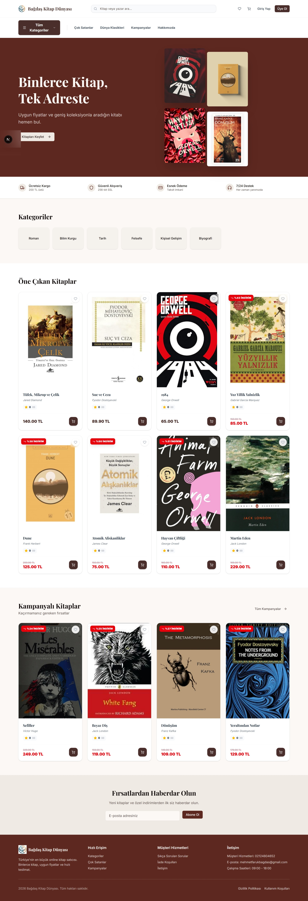 | 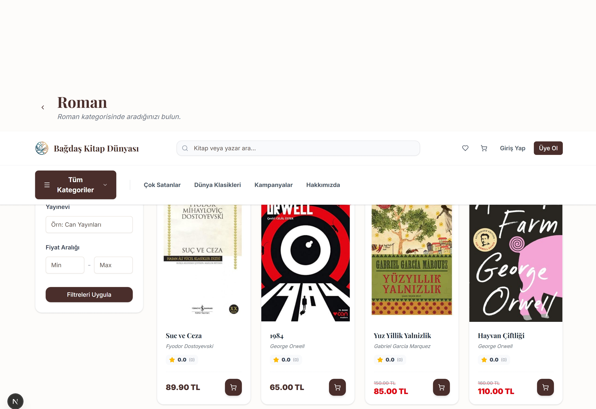 | 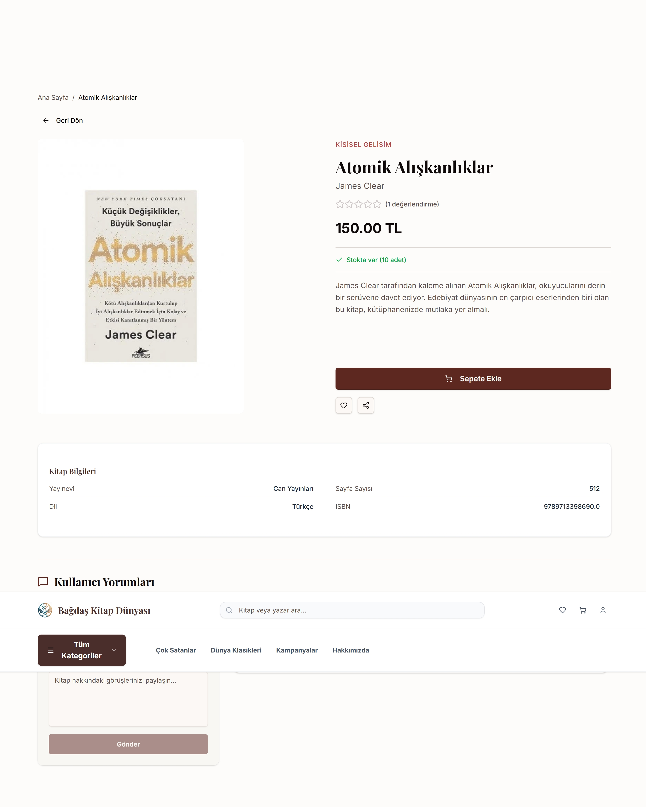 |

| Sepet                                           | Ödeme / Adres                                         | Sipariş Alındı                                           |
| ----------------------------------------------- | ----------------------------------------------------- | -------------------------------------------------------- |
| 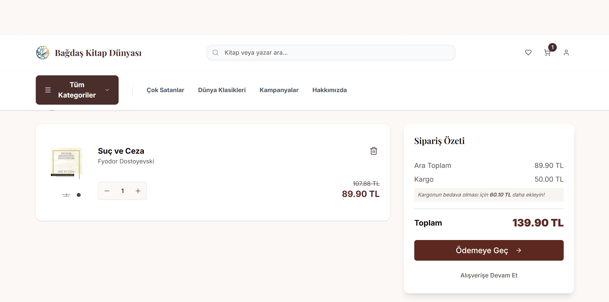 | 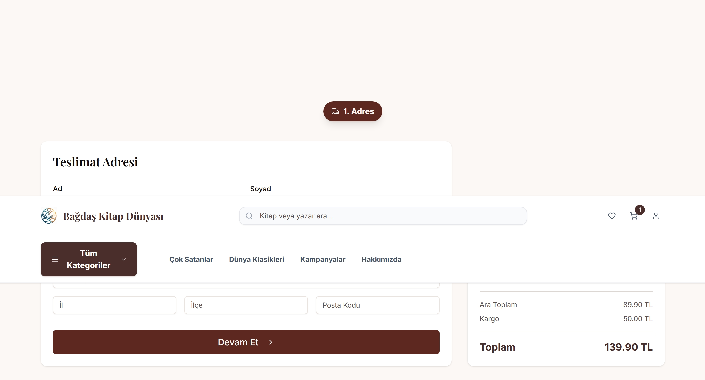 | 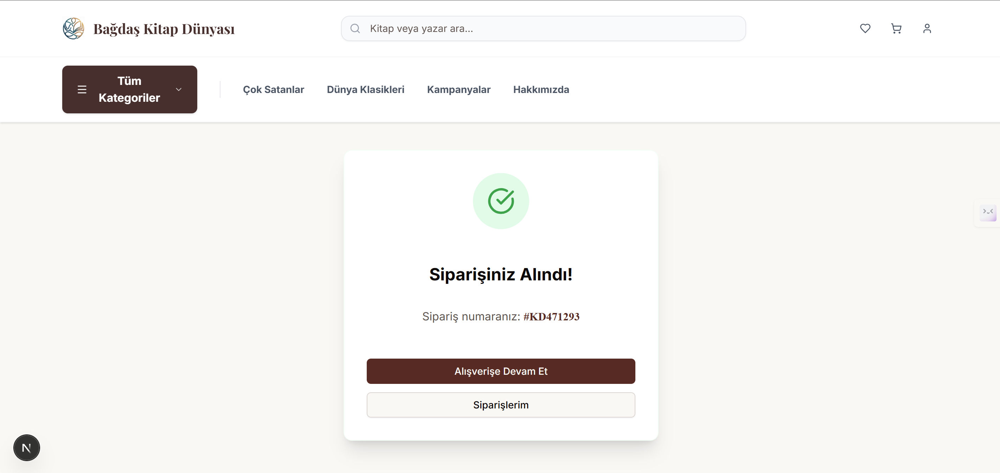 |

### Admin Paneli

| Genel Bakış                                                | Kitaplar                                                 | Siparişler                                                 |
| ---------------------------------------------------------- | -------------------------------------------------------- | ---------------------------------------------------------- |
| 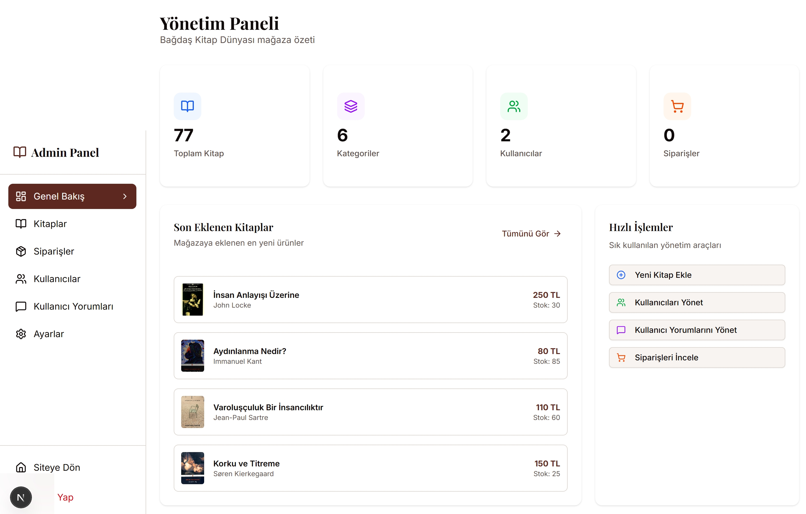 | 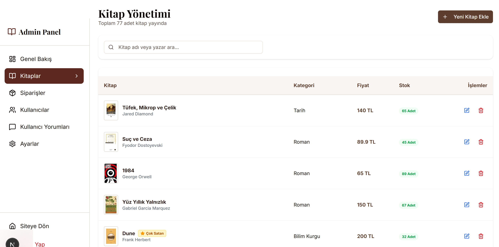 | 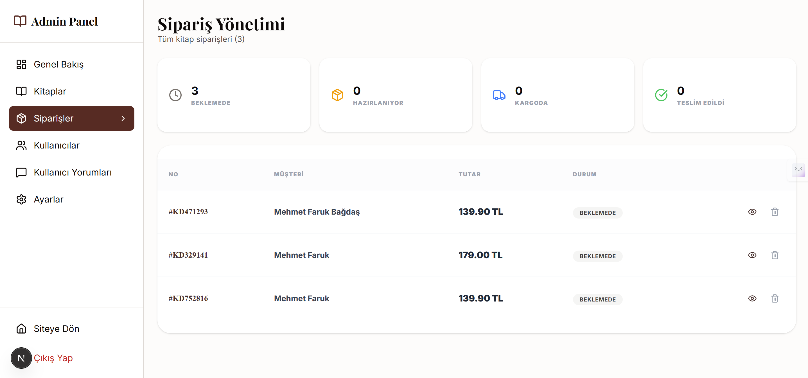 |

| Kullanıcılar                                                 | Yorumlar                                                 | Ayarlar                                                 |
| ------------------------------------------------------------ | -------------------------------------------------------- | ------------------------------------------------------- |
| 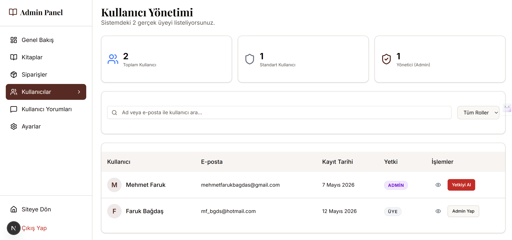 | 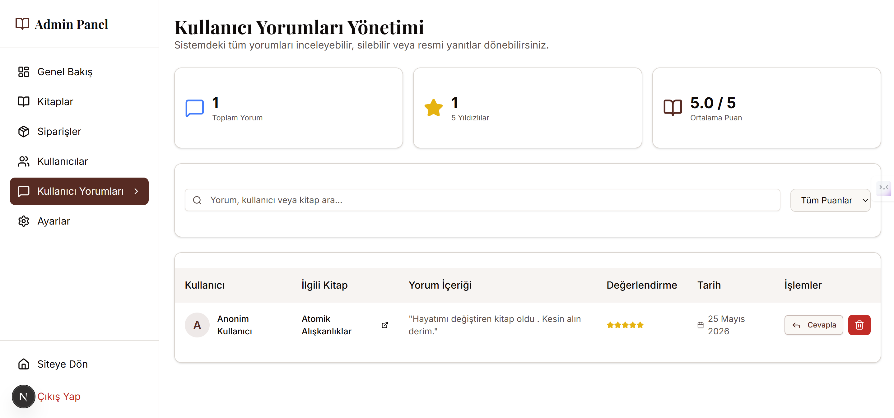 | 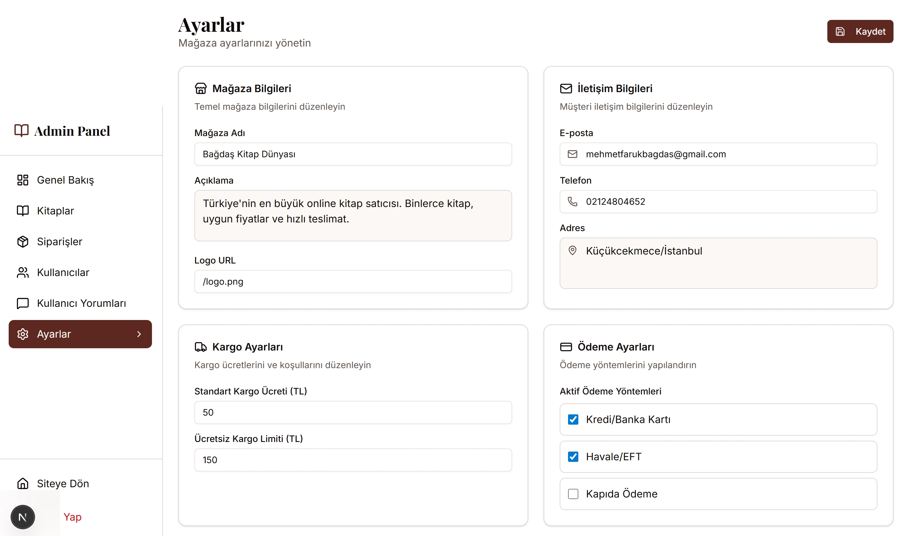 |

---

## Lisans

MIT © 2026 Bağdaş Kitap Dünyası
